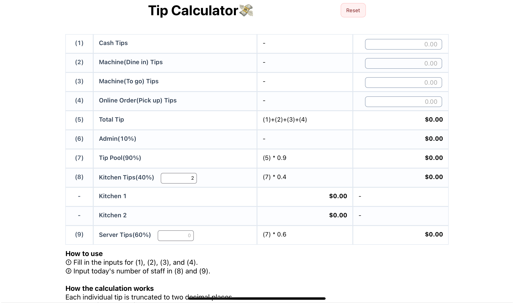

# Tip Calculator

This project was implemented to automate tip calculation for staff.

## How to use

① Fill in the inputs for (1), (2), (3), and (4).
② Input today's number of staff in (8) and (9).

## How the calculation works

Each individual tip is truncated to two decimal places.
Example: $45.678 → $45.67

**How to handle floating-point: Math.trunc((n + Number.EPSILON) \* 100) / 100**

## Screenshot

## Demo

You can try it here: [https://tip-calculator-eosin-ten.vercel.app/](https://tip-calculator-eosin-ten.vercel.app/)
